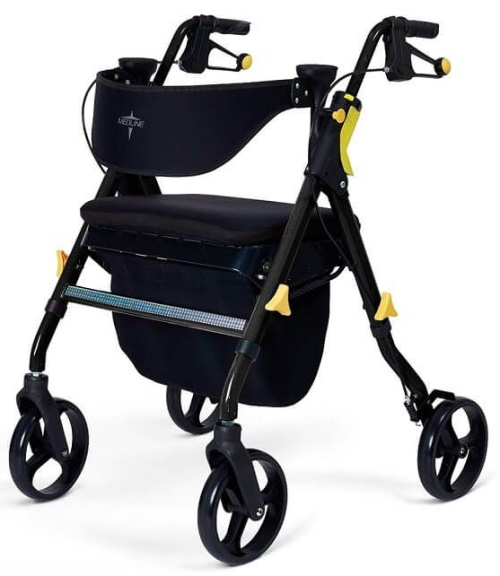
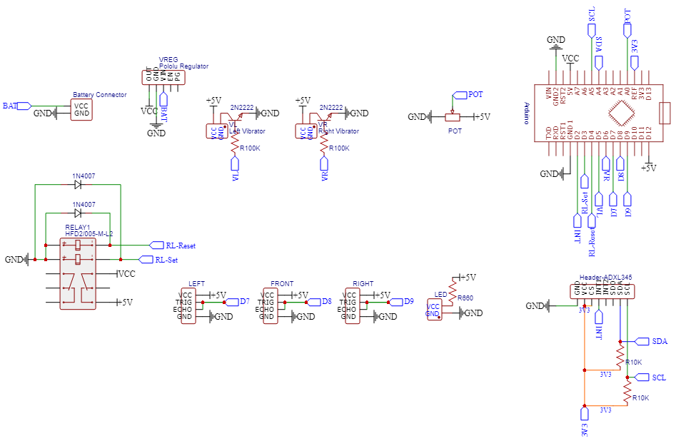
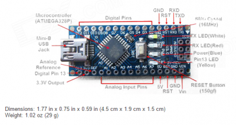
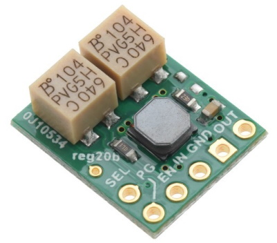
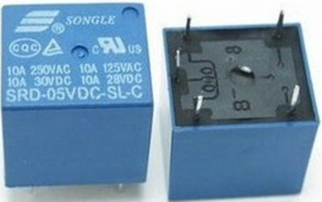
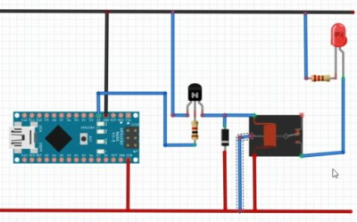

# Rollator-Sensors #

Sonic sensors for a Rollator (Walker).  The goal is to provide assistance for visually impared individuals that must use a walker and thus can not use a blind cane.

The first test unit will be married to a `Medline Empower Rollator Walker`.

  
Medline Empower Rollator Walker

## Requirements ##

* Warn user when nearing obstacles.
  * User adjustable distance range.
  * Vibrate handles
  * three different vibration patterns:
    * front, side, both
* Battery powered without the need for switches
  * Battery must last for at least one week but preferred two weeks

This first unit will be mounted on the front horizontal bar just below the storage bag.

| description       | dimension |
| ----------------- | --------- |
| Overall Width     | 26.5 in   |
| Cross Bar Width   | ~18 in    |
| ~ Cross Bar Angle | 60 deg    |

## Overall Circuit ##

The core of the system is an `Arduino nano` microprocessor (the diagram show an UNO).  No devices (sensors) are powered directly from the microprocessor.

One of the main requirements is that there be no user selectable power switch.  To accomplish this we must powerdown or force devices to enter a sleep-mode.  We use an accelerometer to recognize motion (or lack thereof) and wake up the microprocessor or put it to sleep as needed.  The microprocessor and the accelerometer are the only items that have continuous power, all other devices are powered via a 5V relay.  When the microprocessor sleeps the relay disconnects the power.

The micro processor polls four ultrasonic sensors at an effective rate of 16hz (that is 4hz for each sensor multiplied by the number of sensors).  The four ultrasonic sensors are arraged so that there are two forward facing sensors (slightly angled from straight ahead), and two side facing sensors (left and right).

To provide user feedback, there are two vibrators that will be placed, one in each handle bar.

## Parts List ##

| ID             | Name                     | Qty |
| -------------- | ------------------------ | --- |
| Nano           | Arduino nano             | 1   |
| HC-SR04        | Ultrasonic sensor        | 4   |
| ADXL345        | Accelerometer            | 1   |
| 100K           | Resistor                 | 2   |
| 10K            | Resistor                 | 2   |
| 1K             | Resistor                 | 1   |
| 2N2222         | Transistor               | 3   |
| SRD-05VDC-SL-C | Relay                    | 1   |
| 1N4007         | Diode                    | 1   |
| S9V11MACMA     | Pololu 2.5-16V Regulator | 1   |
| X0023QDG3D     | Vibrator                 | 2   |
| 7.4V 12,000mAh | 18650 (8) Battery Pack   | 2+  |

## Arduino nano ##

The `Arduino Nano V3` microprocessor is the heart of our Rollator-sensor project.

## Battery Pack ##

The `Battery Pack`s will be made from 18650 batteries.  Each pack is configured as 2S4P (2 Series and 4 Parallel).  Each cell is rated at 3000 mAh, providing an overall rating, 7.4V 12000 mAh.

The packs will use EC3 connector (frequently used on R/C models), and a 3 wire balance connector. This will allow the pack to be charged using a standard R/C balance battery charger.

## Voltage Regulator ##

Pololu 2.5-16V Fine-Adjust Step-Up/Step-Down Voltage Regulator w/ Adjustable Low-Voltage Cutoff S9V11MACMA

[Spec. Sheet](https://www.pololu.com/product/2868)

| pin  | description                                             |
| ---- | ------------------------------------------------------- |
| VOUT | Output voltage; determined by the trimmer potentiometer |
| GND  | Ground                                                  |
| VIN  | Input voltage; should be between 3V-16V                 |
| EN   | Enable; used for setting cutoff voltage                 |
| PG   | Power Good                                              |

### Setting the output voltage ###

The output voltage of the regulator is controlled with a 12-turn precision potentiometer. Turning the potentiometer clockwise increases the output voltage, and it can be measured using a multimeter.

### Setting the cutoff voltage ###

The low VIN cutoff voltage of the regulator is controlled by adjusting the voltage at the EN pin with a 12-turn precision potentiometer. When the voltage on the EN pin falls below 0.7V the regulator is put in a low-power sleep state and when the voltage on EN rises back above 0.8V the regulator is turned back on. Turning the potentiometer clockwise increases the low-voltage cutoff. The cutoff voltage can be set by measuring the voltage on the VIN and EN pins and using the potentiometer to adjust the voltage on EN according to the following equation:

EN / 0.7V = VIN / VIN cutoff

EN = VIN * 0.7V / VIN cutoff

For example, if you connect VIN to a battery that currently measures 3.7V and you want to set the cutoff voltage to 3.0V, the equation becomes:

EN / 0.7V = 3.7V / 3.0V

Solving for EN yields approximately 0.86V, so you should turn the potentiometer until you measure that voltage on the EN pin.

Note that the regulator’s low VIN cutoff behavior includes hysteresis: the regulator turns off when EN falls below 0.7V, but it does not turn back on until EN rises above 0.8V. Therefore, VIN must reach about 114% of the cutoff voltage before the regulator will re-enable its output (about 3.43V in this example).

### So for our purposes ###

LiPo VIN cutoff should be 7.0V and the fully charged battery pack should be 8.4V.

EN = 8.4V * 0.7V / 7.0V  
EN = 0.87

Li-Ion VIN cutoff should be 5.6V and the fully charged battery pack should be 8.4V.

EN = 8.3V * 0.7V / 5.6V  
EN = 1.038

## ADXL345 Accelerometer ##

The `Accelerometer` is used for two purposes in our system:

* provide a wakeup/sleep identifier based on motion of the walker.
* recognize that the walker has been layed down on either its back or its side and put the walker to sleep regardless of other motion.

We use the I2C connections using SDA and SCL.

The following table identifies the connections for the
ADXL345 to an Arduino Nano

| ADXL345 | Arduino          | Notes               |
| ------- | ---------------- | ------------------- |
| GND     | GND              |                     |
| VCC     | 3.3V             |                     |
| CS      | 3.3V             |                     |
| INT1    | D2 (INT0) Yellow | use Interrupts      |
| INT2    | -                |                     |
| SD0     | -                |                     |
| SDA     | A4 (SDA) blue    | 10k resistor to VCC |
| SCL     | A5 (SCL) green   | 10k resistor to VCC |

  
Connection Diagram

## HC-SR04 Ultrasonic Sensor ##

There are four HC-SR04 sensors.  Two facing forward,
one facing left, one facing right.

| HC-SR04 | Arduino    | Notes          |
| ------- | ---------- | -------------- |
| Vcc     | 5v         |                |
| Trigger | D5,7,10,12 | Echo connected |
| Echo    | Trigger    |                |
| GND     | GND        |                |

Using the `YogiSonic` library allows us to connect the `trigger` and `echo` pins so we save pins on the Arduino.

## Relay ##

The relay is used to powerdown most of the sensors and other devices while the micro-controller is sleeping.

1k resistor between NPN transistor `base` pin and signal pin on the micro-controller.

1N4007 diode to protect the micro-controller from voltage spikes.

# Power #

|    mA | Notes                      |
| ----: | -------------------------- |
| 120.2 | Batteries to Buck (Active) |
|  19.2 | Batteries to Buck (Sleep)  |
|   3.6 | Buck to Main               |
|  15.6 | Buck load                  |
|       |                            |
|  87.0 | Battery to Pololu (Active) |
|   2.5 | Battery to Pololu (Sleep)  |
|   3.6 | Pololu to Main ?????       |

Question: Why is the "Pololu to Main" more than the "Battery to Pololu"?

## Timed Test w/ LiPo Pack ##

LiPo battery 2S 7.4mAh (nominal) 5200 mAh 35C

| mA   |  Day | Date |
| ---- | ---: | ---- |
| 8.39 |    0 | 7/28 |
| 8.32 |    1 | 7/28 |
| 8.30 |    2 | 7/29 |
| 8.25 |    3 | 7/30 |
| 8.21 |    4 | 7/31 |
| 8.19 |    5 | 8/1  |
| 8.17 |    6 | 8/2  |
| 8.14 |    7 | 8/3  |
| 8.09 |    8 | 8/4  |
| 8.04 |    9 | 8/5  |
| 8.00 |   10 | 8/6  |
| 7.98 |   11 | 8/7  |
| 7.97 |   12 | 8/8  |

At the finishing voltage and the discharge rate we would most likely get three to four weeks of usage on a single charge.

## Timed Test w/ 18650 Battery Pack ##

Li-Ion battery pack 2S4P 7.4 (Nominal) 12000 mAh

| mA   |  Day | Date |
| ---- | ---: | ---- |
| 8.30 |    1 | 8/8  |

Our goal with the Li-Ion pack is to get around four to six weeks of usage on a single charge.

## Battery Voltage Ranges ##

| Type      | Nominal | Max  | Min |
| --------- | ------- | ---- | --- |
| 2S LiPo   | 7.4     | 8.40 | 7.0 |
| 2S Li-Ion | 7.4     | 8.30 | 5.6 |
