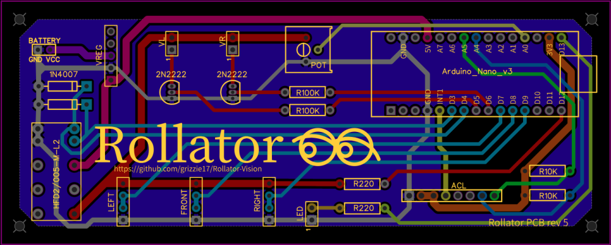
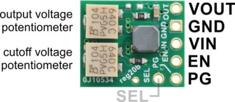
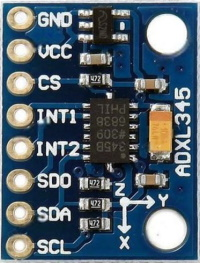
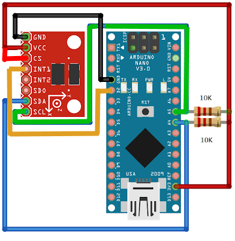
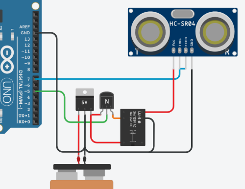

# Rollator-Sensors #

Ultrasonic sensors for a Rollator (Walker).  The goal is to provide assistance for visually impared individuals that must use a walker and thus can not use a blind cane.

The first test unit will be married to a `Medline Empower Rollator Walker`.

  
Medline Empower Rollator Walker

-----

## Requirements ##

* Warn user when nearing obstacles.
  * User adjustable distance range.
  * Vibrate handles
  * three different vibration patterns:
    * front, side, both
* Battery powered without the need for on/off switches
  * Battery must last for at least two weeks but preferred four weeks

This first unit will be mounted on the front horizontal bar in front of the storage bag.

| description       | dimension |
| ----------------- | --------- |
| Overall Width     | 26.5 in   |
| Cross Bar Width   | ~18 in    |
| ~ Cross Bar Angle | 60 deg    |

-----

## Overall Circuit ##

The core of the system is an `Arduino nano` microprocessor.  No devices (sensors) are powered directly from the microprocessor with the exception of the ADXL345 accelerometer (which is powered from the microprocessor's 3.3V pin).

One of the main requirements is that there be no user selectable power switch.  To accomplish this we must powerdown or force devices to enter a sleep-mode.  We use an accelerometer to recognize motion (or lack thereof) and wake up or put the microprocessor to sleep as needed.  The microprocessor and the accelerometer are the only items that have continuous power (but both can be put to sleep), all other devices are powered via a 5V relay.  When the microprocessor sleeps the relay disconnects the power.

The microprocessor polls three ultrasonic sensors at an effective rate of 12hz (that is 4hz for each sensor multiplied by the number of sensors).  The three ultrasonic sensors are aranged with one forward facing sensor, and two side facing sensors (left and right).

To provide user feedback, there are two vibrators that will be placed, one in each handle bar.  No vibration indicates that no obstacles are near.  Vibration from both handles indicates that an obstacle is ahead of the Rollator.  An individual handle vibrating indicates obstacles on the corresponding side.

  
Printed Circuit Board Diagram

-----

## Parts List ##

| ID              | Name                     | Qty |
| --------------- | ------------------------ | --- |
| Nano            | Arduino nano             | 1   |
| HC-SR04         | Ultrasonic sensor        | 3   |
| ADXL345         | Accelerometer            | 1   |
| HFD2-005-M-L2-D | Relay                    | 1   |
| S9V11MACMA      | Pololu 2.5-16V Regulator | 1   |
| X0023QDG3D      | Vibrator                 | 2   |
| LED             | Status LED               | 1   |
| 7.4V 12,000mAh  | 18650 (8) Battery Pack   | 2+  |
|                 |                          |     |
| 100K            | Resistor                 | 2   |
| 10K             | Resistor                 | 2   |
| 660             | Resistor                 | 1   |
| 2N2222          | Transistor               | 3   |
| 1N4007          | Diode                    | 2   |

## Connectors ##

| Name         | Usage                         | Qty |
| ------------ | ----------------------------- | --- |
| 2pin Header  | Battery, Left/Right vibe, LED | 4   |
| 5pin Header  | Voltage regulator             | 1   |
| 4pin Header  | Left/Front/Right Ultrasonic   | 3   |
| 8pin Header  | ADXL345                       | 1   |
| 15pin Header | Arduino nano                  | 2   |
|              |                               |     |
| EC3 Female   | PCB to battery                | 1   |
| EC3 Male     | battery pack                  | 1   |
| 3pin balance | battery pack                  | 1   |
|              |                               |     |
| RCA Female   | connector to PCB              | 2   |
| RCA Male     | lead to vibrator              | 2   |

-----

## Arduino nano ##

The `Arduino Nano V3` microprocessor is the heart of our Rollator-sensor project.

Please see the tables in the sections below for connection details to the Arduino.

-----

## Battery Pack ##

The `Battery Pack` will be made from 18650 batteries.  Each pack is configured as 2S4P (2 Series and 4 Parallel).  Each cell is rated at 3000 mAh, providing an overall rating, 7.4V 12000 mAh.

The packs will use an EC3 connector (frequently used on R/C models), and a 3 wire balance connector. This will allow the pack to be charged using a standard R/C balancing battery charger (that includes a Li-Ion setting).

-----

## Voltage Regulator ##

Pololu 2.5-16V Fine-Adjust Step-Up/Step-Down Voltage Regulator w/ Adjustable Low-Voltage Cutoff S9V11MACMA

[Spec. Sheet](https://www.pololu.com/product/2868)

| pin  | description                                             |
| ---- | ------------------------------------------------------- |
| VOUT | Output voltage; determined by the trimmer potentiometer |
| GND  | Ground                                                  |
| VIN  | Input voltage; should be between 3V-16V                 |
| EN   | Enable; used for setting cutoff voltage                 |
| PG   | Power Good                                              |

### Setting the output voltage ###

The output voltage of the regulator is controlled with a 12-turn precision potentiometer. Turning the potentiometer clockwise increases the output voltage, and it can be measured using a multimeter.

### Setting the cutoff voltage ###

The low VIN cutoff voltage of the regulator is controlled by adjusting the voltage at the EN pin with a 12-turn precision potentiometer. When the voltage on the EN pin falls below 0.7V the regulator is put in a low-power sleep state and when the voltage on EN rises back above 0.8V the regulator is turned back on. Turning the potentiometer clockwise increases the low-voltage cutoff. The cutoff voltage can be set by measuring the voltage on the VIN and EN pins and using the potentiometer to adjust the voltage on EN according to the following equation:

EN / 0.7V = VIN / VIN cutoff

EN = VIN * 0.7V / VIN cutoff

For example, if you connect VIN to a battery that currently measures 3.7V and you want to set the cutoff voltage to 3.0V, the equation becomes:

EN / 0.7V = 3.7V / 3.0V

Solving for EN yields approximately 0.86V, so you should turn the potentiometer until you measure that voltage on the EN pin.

Note that the regulator’s low VIN cutoff behavior includes hysteresis: the regulator turns off when EN falls below 0.7V, but it does not turn back on until EN rises above 0.8V. Therefore, VIN must reach about 114% of the cutoff voltage before the regulator will re-enable its output (about 3.43V in this example).

### So for our purposes ###

LiPo VIN cutoff should be 7.0V and the fully charged battery pack should be 8.4V.

EN = 8.4V * 0.7V / 7.0V  
EN = 0.87

Li-Ion VIN cutoff should be 5.6V and the fully charged battery pack should be 8.3V.

EN = 8.3V * 0.7V / 5.6V  
EN = 1.038

-----

## ADXL345 Accelerometer ##

The `Accelerometer` is used for two purposes in our system:

* provide a wakeup/sleep identifier based on motion of the walker.
* recognize that the walker has been layed down on either its back or its side and put the walker to sleep regardless of other motion.

We use the I2C connections using SDA and SCL.

The following table identifies the connections for the
ADXL345 to an Arduino Nano

| ADXL345 | Arduino          | Notes               |
| ------- | ---------------- | ------------------- |
| GND     | GND              |                     |
| VCC     | 3.3V             |                     |
| CS      | 3.3V             |                     |
| INT1    | D2 (INT0) Yellow | use Interrupts      |
| INT2    | -                |                     |
| SD0     | -                |                     |
| SDA     | A4 (SDA) blue    | 10k resistor to VCC |
| SCL     | A5 (SCL) green   | 10k resistor to VCC |
|         |                  |                     |
  
  
  
Connection Diagram

> The `VCC` and `GND` are not actually directly hooked to the Arduino.  They are connected to the previously mentioned [voltage regulator](#voltage-regulator).

-----

## Relay ##

The relay is used to power-up the ultrasonic sensors and other devices (with the exception of the ADXL345) for when they are needed. Otherwise they are powered-down.

> Please note that the pins identified above are not sequential.  They are using position on a breadboard (e.g., pins 3,5,7,10,12,14) are non-existant. In our case, we will not be using pins 6, 9-13.

The relay being used has been changed to the HFD2/005-M-L2-D which is a double poll double throw relay.  The important part of this relay is that it does not require power to maintain set/reset condition.  There are two pins that control the unit; one for `set` (on) and the other for `reset` (off).  Setting the appropriate pin to +5V for 5 milliseconds will change the relay setting.

| Relay | Arduino | Circuit         |
| ----- | ------- | --------------- |
| 1     | D3      | (reset)         |
| 2     | D4      | (set)           |
| 4     |         | VCC (from Reg.) |
| 8     |         | OUT +5V         |
| 16,15 | GND     | GND             |

-----

## HC-SR04 Ultrasonic Sensors ##

There are three HC-SR04 sensors.  One facing forward,
one facing left, one facing right.

| HC-SR04 | Arduino | Notes          |
| ------- | ------- | -------------- |
| VCC     | -       | Relay VOUT     |
| Trigger | D7,8,9  | Echo connected |
| Echo    | Trigger |                |
| GND     | GND     |                |

Using the `YogiSonic` library allows us to connect the `trigger` and `echo` pins so we save pins on the Arduino.

> This diagram is not completely accurate but does represent an external battery being sent through a voltage regulator and then a [relay](#relay).

-----

## Vibrator ##

* Size: 7 x 25 mm
* Voltage: 1.5-3V

Used in Rollator/Walker hand-grips to notify user of obstacles.

We will use RCA jacks to connect the vibrator to the sensor housing (box).

-----

# Assembly #

* Solder in resistors first.
* Solder headers for:
  * battery
  * voltage regulator
  * Arduino nano
  * left/right vibrators
  * Ultrasonic sensors
  * LED
  * accelerometer
* Solder two NPN BJTs (2N2222)
* Solder potentiometer
* Solder relay

* Create wiring harnesses: (provide some slack but not too much). All wiring harnesses will use ribbon cables with Dupont connectors.
  * battery - 2 wire - with EC3 connector on the battery side
  * left/right vibrators - 2 wire - male connectors to female RCA jacks - vibrator to male RCA jacks
  * LED - 2 wire
  * left/front/right ultrasonic sensors - four wire - male on one side and female on the other
  * ADXL345? - 8 wire

-----

# Power #

This section contains measured information for the power usage and batteries.

|    mA | Notes                      |
| ----: | -------------------------- |
| 120.2 | Batteries to Buck (Active) |
|  19.2 | Batteries to Buck (Sleep)  |
|   3.6 | Buck to Main               |
|  15.6 | Buck load                  |
|       |                            |
|  87.0 | Battery to Pololu (Active) |
|   2.5 | Battery to Pololu (Sleep)  |
|   3.6 | Pololu to Main ?????       |

Question: Why is the "Pololu to Main" more than the "Battery to Pololu"?

## Endurance Test w/ LiPo Pack ##

LiPo battery 2S 7.4mAh (nominal) 5200 mAh 35C

| mA   |  Day | Date |
| ---- | ---: | ---- |
| 8.39 |    0 | 7/28 |
| 8.32 |    1 | 7/28 |
| 8.30 |    2 | 7/29 |
| 8.25 |    3 | 7/30 |
| 8.21 |    4 | 7/31 |
| 8.19 |    5 | 8/1  |
| 8.17 |    6 | 8/2  |
| 8.14 |    7 | 8/3  |
|      |      |      |
| 8.09 |    8 | 8/4  |
| 8.04 |    9 | 8/5  |
| 8.00 |   10 | 8/6  |
| 7.98 |   11 | 8/7  |
| 7.97 |   12 | 8/8  |

At the finishing voltage and the discharge rate we would most likely get close to three weeks of usage on a single charge.

## Endurance Test w/ 18650 Battery Pack ##

Li-Ion battery pack 2S4P 7.4 (Nominal) 12000 mAh

| mA   |  Day | Date |
| ---- | ---: | ---- |
| 8.30 |    0 | 8/8  |
| 8.28 |    1 | 8/8  |
| 8.25 |    2 | 8/9  |
| 8.24 |    3 | 8/10 |
| 8.22 |    4 | 8/11 |
| 8.21 |    5 | 8/12 |
| 8.19 |    6 | 8/13 |
| 8.18 |    7 | 8/14 |
|      |      |      |
| 8.16 |    8 | 8/15 |
| 8.16 |    9 | 8/16 |
| 8.16 |   10 | 8/17 |
| 8.15 |   11 | 8/18 |
| 8.15 |   12 | 8/19 |
| 8.14 |   13 | 8/20 |
| 8.13 |   14 | 8/21 |
|      |      |      |
| 8.13 |   15 | 8/22 |

Our goal with the Li-Ion pack is to get around four weeks of usage on a single charge.

## Battery Voltage Ranges ##

| Type      | Nominal | Max  | Min |
| --------- | ------- | ---- | --- |
| 2S LiPo   | 7.4     | 8.40 | 7.0 |
| 2S Li-Ion | 7.4     | 8.30 | 5.6 |
